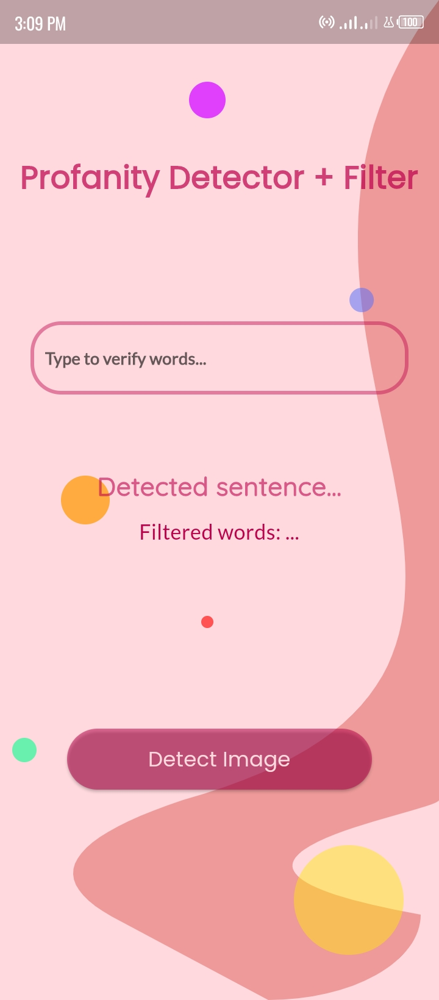
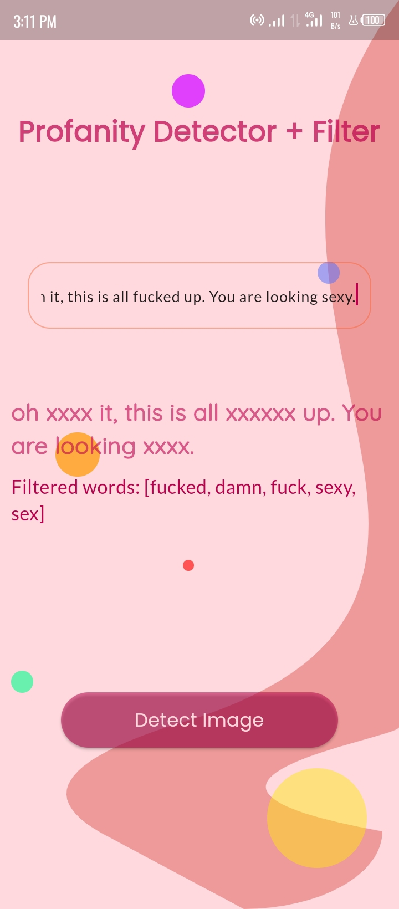
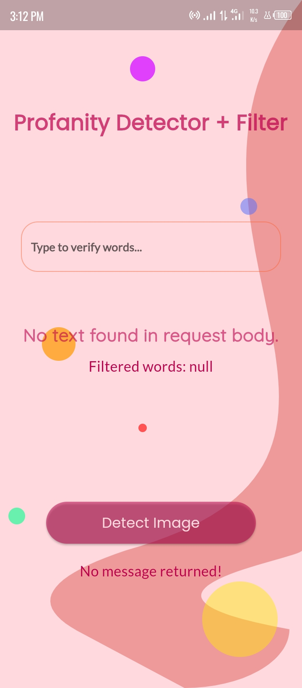

# flutterassignment

Kgp2 SS Flutter Development Internship Assignment.

Expected to create a demo app which contains 2 features:

1. Verify bad(Profanity) words when ever you are typing on textfield.
2. Verify nudity content of Images.

## Screenshots





## Responses

API responses for the two features in json format:

### Example Image Response

```json
{
  "error_code": 0,
  "predictions": {
    "appearance_clothing_swimwear_bikini": 0.94,
    "appearance_clothing_underwear_lingerie": 0.94,
    "artificial-images": 0.99,
    "composition_one_female": 0.59,
    "unsafe": 1
  }
}
```

### Example Word Response

To post request data for the two features in json format:

```json
{
  "clean": "What is this xxxx. You have to do better than that.",
  "language": "en",
  "profanities": [
    "shit"
  ]
}
```

## Requests

### Word Request

```json
{
  "text": "What is this shit. You have to do better than that.",
  "maskCharacter": "x",
  "language": "en"
}
```

### Image Request

```json
{
  "api_key": "test_fake_image_rapid",
  "base64_image": "iVBORw0KGgoAAAANSUhEUgAABAAAAAQACAIAAADwf7zU"
}
```

&#124; <b>Added:</b> &#124;

* Beautify background! :joy:

## Getting Started

This project is a starting point for a Flutter application.

A few resources to get you started if this is your first Flutter project:

- [Lab: Write your first Flutter app](https://docs.flutter.dev/get-started/codelab)
- [Cookbook: Useful Flutter samples](https://docs.flutter.dev/cookbook)

For help getting started with Flutter development, view the
[online documentation](https://docs.flutter.dev/), which offers tutorials,
samples, guidance on mobile development, and a full API reference.
